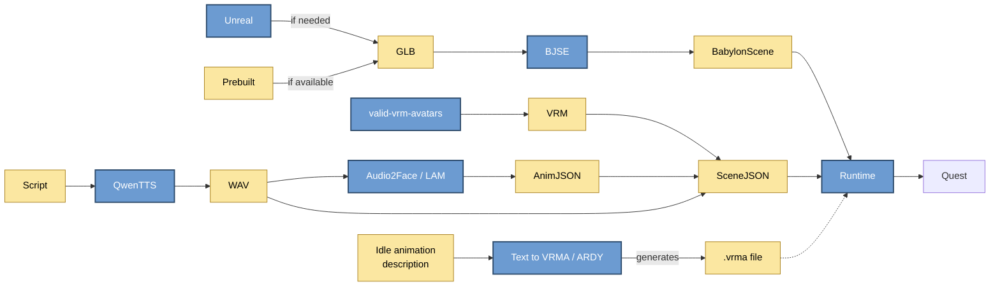
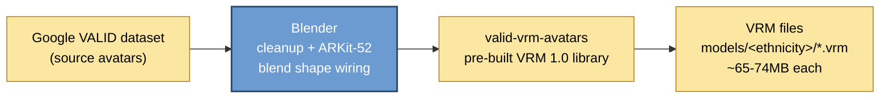
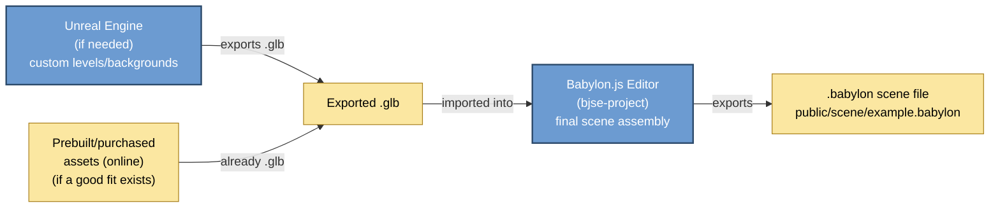
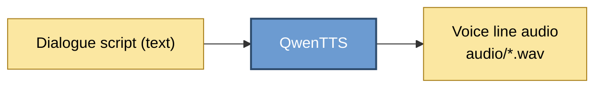
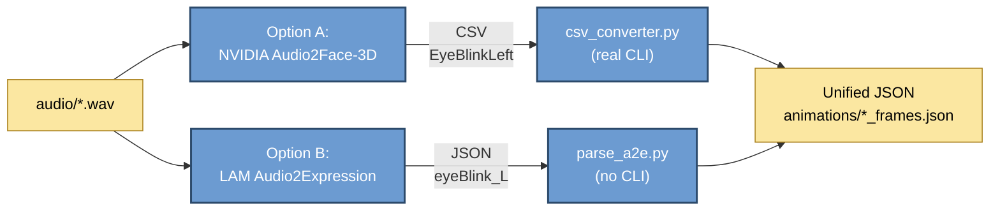
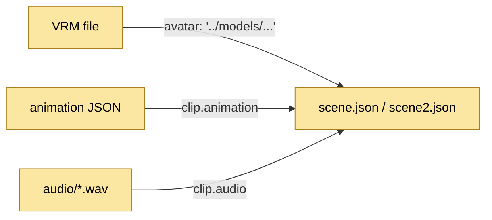
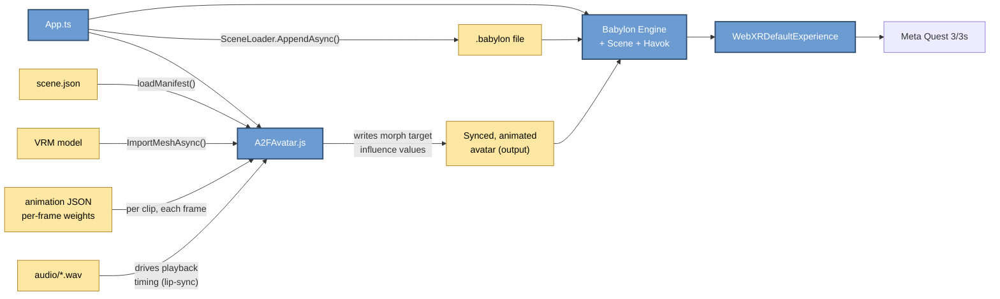
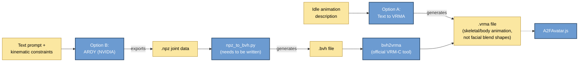

# VRET Tech Pipeline

Source-grounded in `babylon-clay-scene` (legacy `TLTMedia/VRET`, jungu + bennett branches) — every node below is either a tool/file I actually found in that project, or a file I watched it load at runtime.

Split into one small diagram per stage (instead of one giant flowchart) so each one actually fits the pane.

🔵 blue = software/program (actually does something) · 🟡 amber = data/file/artifact (gets produced or consumed)

## Overview

---

## 1. Character creation

The character avatars are pulled from [valid-vrm-avatars](https://github.com/TLTMedia/valid-vrm-avatars), a pre-built library — not built from scratch per-character. It's VRM 1.0 conversions of Google Research's VALID (Visually Aligned Inclusive Dataset) avatars, extended with ARKit-52 blend shapes (TLTMedia's `cleanFace.md` documents the Blender cleanup process used to wire them). Files are organized by ethnicity, then named `{Ethnicity}_{Sex}_{BodyType}_{Outfit}.vrm` (e.g. `Black_F_1_Casual.vrm`). Both avatars in the running demo come from this library, not custom builds. The `models/` folder in the legacy repo is a superset of this library — it also has non-ethnicity content (a `MetaHuman/` folder, named individual characters, environment props) that falls outside what this library covers.

These VRM files sit as a **sibling** of `babylon-clay-scene/`, not inside it — a custom Vite dev-server plugin in `vite.config.ts` reaches up one directory to serve `/models/...` and `/vrma/...` at request time.

## 2. Environment authoring

Unreal is **conditional, not mandatory** — it's for building custom levels/backgrounds when nothing suitable already exists. If a prebuilt/purchased environment asset online is a good enough fit, that gets used directly instead, skipping Unreal authoring entirely. Either path converges on the same `.glb` handoff into the Babylon.js Editor for final scene assembly before export as the `.babylon` file the runtime loads. The existing demo scene was built entirely in the Babylon.js Editor with no Unreal or external asset content — this GLB handoff is a gap to fill either way, not something already working (see Open Questions).

One point in GLB's favor: `App.ts` already imports `@babylonjs/loaders/glTF`, so the runtime can load `.glb`/`.gltf` natively. Worth deciding whether Unreal's GLB export always gets pre-combined into the `.babylon` file via the Editor, or whether it could instead be loaded directly at runtime alongside it — see Open Questions.

## 3. Voice generation

QwenTTS takes a dialogue script and generates the character's voice lines offline.

## 4. Facial animation — choose ONE option per clip

Both tools take the same `.wav` audio and independently generate facial blend-shape animation — they're alternatives, not a chain, with different output formats/naming conventions each normalized by its own converter into the same schema (`fps`, `frameCount`, `blendShapeNames`, `frames`). `csv_converter.py` is the more finished of the two (real CLI, reads shape names from the CSV header); `parse_a2e.py` has the 52 names hardcoded and no CLI. All 4 of this demo's clips went through the **Audio2Face → CSV** path; LAM was only spot-tested on one clip.

## 5. Scene manifest (hand-authored)

`scene.json`/`scene2.json` tie everything together per character: which VRM to load, idle/breathing parameters, and an ordered list of clips pairing one animation JSON with one audio WAV.

## 6. Runtime

`App.ts` boots the Babylon engine, loads the base `.babylon` environment, then creates an `A2FAvatar` per character. `A2FAvatar` is the pipeline's actual end consumer, not another conversion step — its real inputs are the VRM model, the scene manifest, the per-clip animation JSON, and the clip's audio WAV; its output is a live, synced, animated avatar (morph-target weights applied every render frame, timed to `audio.currentTime` so lip-sync holds even if a frame renders late) that becomes part of the scene the Engine renders. WebXR ships that to the Meta Quest 3/3s, the confirmed deployment target.

**GitHub** (SBU-VRET/VRET-Project) is the storage/versioning layer underneath every stage above.

## 7. Idle/body animation (VRMA) — choose ONE option

A separate animation track from Stage 4/6 — VRMA drives the avatar's *skeleton* (bones like `hips`, `spine`, retargeted by name), not the face. It covers idle poses/gestures/movement, where the Audio2Face/LAM pipeline only ever touches facial blend shapes. `A2FAvatar.applyVRMA(vrmaPath)` loads a `.vrma` file and retargets its animation tracks onto the avatar's bones, but neither demo character's `App.ts` setup calls it.

**Option A — [Text to VRMA](https://github.com/Kirakun0328/text-to-vrma).** Outputs `.vrma` directly — consumable by `applyVRMA()` with no extra conversion step.

**Option B — [ARDY](https://github.com/nv-tlabs/ardy)** (NVIDIA + ETH Zürich, SIGGRAPH 2026). A diffusion model that generates new motion in real-time from a text prompt plus optional kinematic constraints (root path/waypoints, keyframes, sparse joint positions) — it synthesizes motion, it doesn't select from a preset library. Output is `.npz` (world-space joint positions, local/global rotations, root position, foot contacts) across three skeleton options (a generic "Core" humanoid, Unitree G1 robot, or SOMA body model — "coming soon"). No VRM/VRMA export directly, but a usable path exists: **[bvh2vrma](https://github.com/vrm-c/bvh2vrma)** — the official VRM Consortium tool for converting BVH motion capture into VRMA — covers the second half of the job. That leaves one real gap: a small `npz_to_bvh.py` script to turn ARDY's joint data into BVH, which `bvh2vrma` can then convert to `.vrma`. Comparable in scope to `csv_converter.py`/`parse_a2e.py` in Stage 4, not a from-scratch VRMA/glTF exporter. Also requires local GPU inference for ARDY itself (Python 3.10+, PyTorch 2.4+, CUDA, RTX 4090 recommended).

## Open questions / TODO
- [ ] **Unreal/prebuilt → GLB → Babylon.js Editor handoff doesn't exist yet.** Format is decided (`.glb`), but there's no converter/import workflow built or documented yet — true whether the GLB comes from Unreal or a purchased/prebuilt asset. Owner: Kevin, per his Unreal/Babylon compatibility task.
- [ ] Check whether prebuilt environment assets (asset stores, Sketchfab, etc.) can cover enough scenes to skip custom Unreal work for the first demo — worth doing before investing in the Unreal pipeline
- [ ] Decide: does the GLB always get pre-combined into the `.babylon` file via the Babylon.js Editor, or can it be loaded directly at runtime (the `@babylonjs/loaders/glTF` import in `App.ts` means the runtime already supports this)?
- [ ] Clarify whether Unreal's export also needs to carry behavior-tree/Smart Object data (Kevin's Spring task), or whether that's a separate pipeline from the background/geometry export
- [ ] **Validate Text to VRMA vs. ARDY** as the idle-animation source (Fahim's task) and actually wire `applyVRMA()` into `App.ts` for at least one character
- [ ] **Write `npz_to_bvh.py`** if ARDY is chosen — converts ARDY's joint data to BVH, then feed that into [bvh2vrma](https://github.com/vrm-c/bvh2vrma) (official, already exists) to get `.vrma`. Note bvh2vrma's own README doesn't guarantee results for every BVH file, so the joint-name/hierarchy mapping needs real testing, not just a format match on paper. **Lower priority / later** — not blocking current work.
- [ ] Check whether the team has access to an RTX 4090 (or equivalent) if ARDY is the chosen path — it's a local-inference research model, not a lightweight tool
- [ ] Find out if the top-level `vrma/` folder (referenced by the same Vite middleware as `models/`) has any existing `.vrma` content worth testing `applyVRMA()` against, or if it's currently empty/reserved
- [ ] Check whether `bjse-plugin` is a custom Babylon Editor plugin built for this project, or a vendored third-party tool
