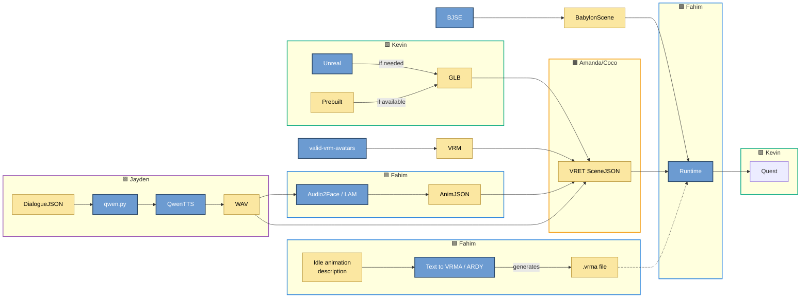
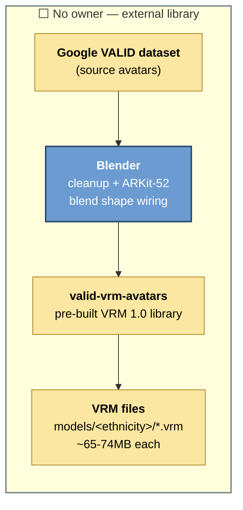
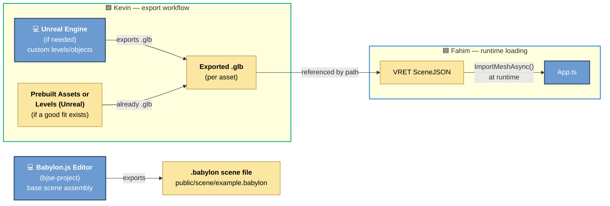
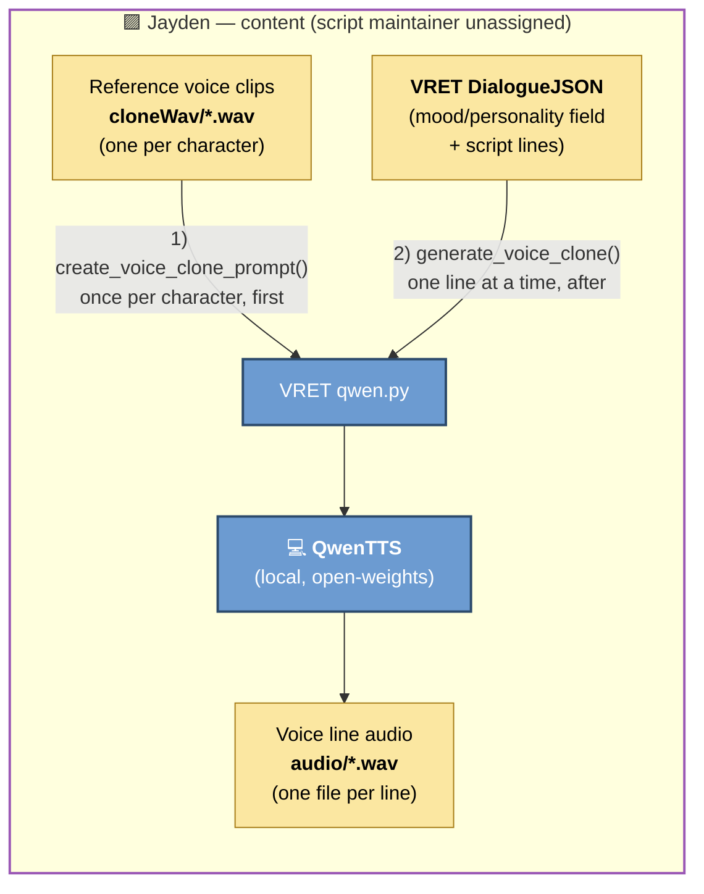
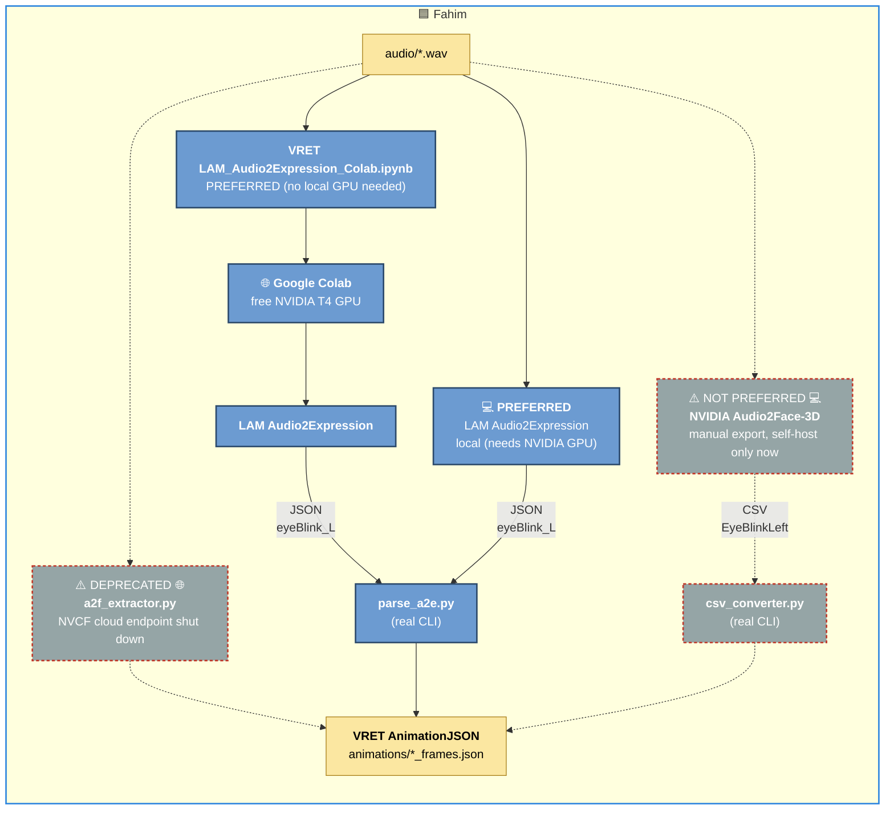
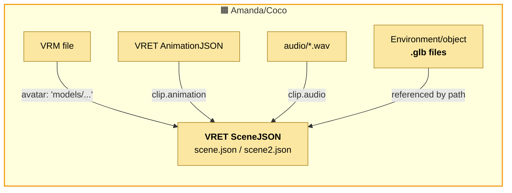
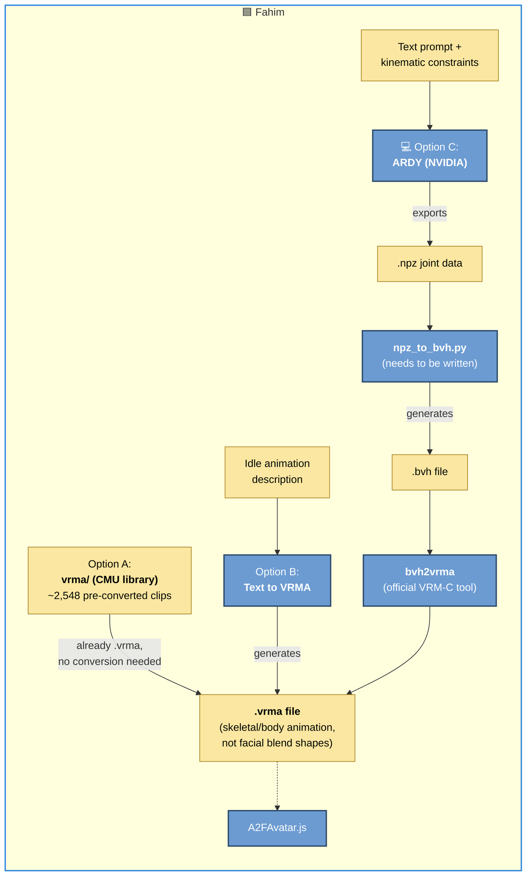

# VRET Tech Pipeline

Source-grounded in `babylon-clay-scene` (legacy `TLTMedia/VRET`, jungu + bennett branches) — every node below is either a tool/file I actually found in that project, or a file I watched it load at runtime.

Split into one small diagram per stage (instead of one giant flowchart) so each one actually fits the pane.

🔵 blue = software/program (actually does something) · 🟡 amber = data/file/artifact (gets produced or consumed)

🌐 = runs online/in the cloud (needs a live connection) · 💻 = runs offline/locally (no network dependency once set up) — marked on tool nodes where this is established; unmarked tools haven't been confirmed either way yet.

**Ownership boundaries:** thin colored boxes inside each diagram mark which nodes a specific person owns — 🟦 Fahim · 🟩 Kevin · 🟪 Jayden · 🟧 Amanda/Coco · ⬜ no owner (external). Nodes outside any colored box have no single assigned owner.

## Overview

```mermaid
flowchart LR
    Library["valid-vrm-avatars"] --> VRM

    subgraph K_export["🟩 Kevin"]
    Unreal -->|"if needed"| GLB
    Prebuilt -->|"if available"| GLB
    end

    BJSE --> BabylonScene

    subgraph AC_scene["🟧 Amanda/Coco"]
    SceneJSON["VRET SceneJSON"]
    end
    GLB --> SceneJSON

    subgraph J_voice["🟪 Jayden"]
    DialogueJSON --> PyScript["qwen.py"] --> QwenTTS --> WAV
    end

    subgraph F_facial["🟦 Fahim"]
    FaceTool["Audio2Face / LAM"]
    AnimJSON
    end
    WAV --> FaceTool --> AnimJSON

    VRM --> SceneJSON
    AnimJSON --> SceneJSON
    WAV --> SceneJSON

    subgraph F_runtime["🟦 Fahim"]
    Runtime
    end
    BabylonScene --> Runtime
    SceneJSON --> Runtime

    subgraph K_device["🟩 Kevin"]
    Quest
    end
    Runtime --> Quest

    subgraph F_idle["🟦 Fahim"]
    IdleDesc["Idle animation<br/>description"] --> IdleTool["Text to VRMA / ARDY"] -->|generates| VRMAFile[".vrma file"]
    end
    VRMAFile -.-> Runtime

    classDef tool fill:#6c9bd1,stroke:#2c4a6b,stroke-width:2px,color:#fff;
    classDef artifact fill:#fbe7a1,stroke:#a87f1a,stroke-width:1px,color:#000;
    class Library,Unreal,BJSE,PyScript,QwenTTS,FaceTool,Runtime,IdleTool tool
    class VRM,GLB,Prebuilt,BabylonScene,DialogueJSON,WAV,AnimJSON,SceneJSON,IdleDesc,VRMAFile artifact

    style K_export stroke:#10AC84,stroke-width:2px
    style K_device stroke:#10AC84,stroke-width:2px
    style F_facial stroke:#2E86DE,stroke-width:2px
    style F_runtime stroke:#2E86DE,stroke-width:2px
    style F_idle stroke:#2E86DE,stroke-width:2px
    style J_voice stroke:#9B59B6,stroke-width:2px
    style AC_scene stroke:#F39C12,stroke-width:2px
```

- No owner (⬜) is implicit: `Library`, `VRM`, `BJSE`, `BabylonScene` sit outside every colored box.
- Kevin and Fahim each appear in more than one box — they own several disconnected parts of this flow, not one contiguous chunk.
- `QwenTTS` mechanics (voice cloning, local vs. hosted): Stage 3, `docs/QWENTTS.md`.

---

## 1. Character creation

⬜ **Owner:** no dedicated owner — sourced entirely from the existing valid-vrm-avatars library, not custom-built. Amanda/Coco reference it in their schema documentation.

```mermaid
flowchart LR
    subgraph S1["⬜ No owner — external library"]
    VALID["<b>Google VALID dataset</b><br/>(source avatars)"] --> Blender["<b>Blender</b><br/>cleanup + ARKit-52<br/>blend shape wiring"]
    Blender --> Library["<b>valid-vrm-avatars</b><br/>pre-built VRM 1.0 library"]
    Library --> VRM["<b>VRM files</b><br/>models/&lt;ethnicity&gt;/*.vrm<br/>~65-74MB each"]
    end

    style S1 stroke:#7F8C8D,stroke-width:2px
    classDef tool fill:#6c9bd1,stroke:#2c4a6b,stroke-width:2px,color:#fff;
    classDef artifact fill:#fbe7a1,stroke:#a87f1a,stroke-width:1px,color:#000;
    class Blender tool
    class VALID,Library,VRM artifact
```

- Avatars come from [valid-vrm-avatars](https://github.com/TLTMedia/valid-vrm-avatars): VRM 1.0 conversions of Google/UCF's VALID avatars, not built per-character.
- ARKit-52 blend shapes added on top via a Blender cleanup pass (`cleanFace.md`).
- Naming: `{Ethnicity}_{Sex}_{BodyType}_{Outfit}.vrm` (e.g. `Black_F_1_Casual.vrm`).
- Both avatars in the running demo come from this library.
- The legacy repo's `models/` folder is a superset — also has a `MetaHuman/` folder, named individual characters, and environment props outside this library.
- Full writeup (license, pros/cons): `docs/EXISTING_MODELS.md`.
- VRM files are served from `babylon-clay-scene/public/models/`, directly by Vite in both dev and production.

## 2. Environment authoring

🟩 **Owner:** Kevin (export workflow) · 🟦 Fahim (runtime loading)

```mermaid
flowchart LR
    subgraph K2["🟩 Kevin — export workflow"]
    Unreal["💻 <b>Unreal Engine</b><br/>(if needed)<br/>custom levels/objects"] -->|"exports .glb"| GLB["<b>Exported .glb</b><br/>(per asset)"]
    Prebuilt["<b>Prebuilt Assets or<br/>Levels (Unreal)</b><br/>(if a good fit exists)"] -->|"already .glb"| GLB
    end
    subgraph F2["🟦 Fahim — runtime loading"]
    GLB -->|"referenced by path"| SceneJSON["VRET SceneJSON"]
    SceneJSON -->|"ImportMeshAsync()<br/>at runtime"| AppTS["App.ts"]
    end
    BJSE["💻 <b>Babylon.js Editor</b><br/>(bjse-project)<br/>base scene assembly"] -->|exports| BabylonScene["<b>.babylon scene file</b><br/>public/scene/example.babylon"]

    style K2 stroke:#10AC84,stroke-width:2px
    style F2 stroke:#2E86DE,stroke-width:2px
    classDef tool fill:#6c9bd1,stroke:#2c4a6b,stroke-width:2px,color:#fff;
    classDef artifact fill:#fbe7a1,stroke:#a87f1a,stroke-width:1px,color:#000;
    class Unreal,BJSE,AppTS tool
    class GLB,Prebuilt,BabylonScene,SceneJSON artifact
```

- Unreal is conditional, not mandatory — only for custom levels/objects when nothing suitable already exists.
- "Prebuilt" = either prebuilt assets (individual objects) or prebuilt levels (whole environments) — used directly instead of custom authoring when a good fit exists.
- Either path produces a `.glb` per asset. `BJSE` has no single assigned owner.
- **Decided:** `.glb` assets are referenced by path in `VRET SceneJSON` and loaded individually at runtime (`ImportMeshAsync` in `App.ts`), not pre-combined into `.babylon` via the Editor — scenes change as a whole and need asset-level swappability. This runtime handoff isn't built yet (see Open Questions).
- **BJSE vs. the Babylon Engine:** BJSE is an offline editor — assembles the base scene (lights, camera, environment, static geometry) and exports a static `.babylon` file; no role at runtime. The Babylon Engine is the runtime library bundled into the deployed app — reads `.babylon` + `.glb`/VRM files live, in the browser. `VRET SceneJSON`'s assets load into the Engine at runtime, never pre-combined into `.babylon` via BJSE.
- Tradeoff: N separate `.glb` loads cost more than one pre-combined file (more round-trips, more draw calls). Mitigate with parallel loading (`Promise.all`, not sequential), Draco/KTX2 compression, and modest poly/texture budgets — this ships to standalone Quest hardware.

## 3. Voice generation

🟪 **Owner:** Jayden (script/dialogue content, mood/personality direction). The calling script itself (`qwen.py`) has no assigned maintainer yet, and currently sits untracked in `temp/qwenTTS/`, pulled from the old repo's `jayden`/`paul` branches — not yet part of the tracked pipeline.

```mermaid
flowchart LR
    subgraph S3["🟪 Jayden — content (script maintainer unassigned)"]
    CloneWAV["Reference voice clips<br/><b>cloneWav/*.wav</b><br/>(one per character)"] -->|"1) create_voice_clone_prompt()<br/>once per character, first"| PyScript["VRET qwen.py"]
    DialogueJSON["<b>VRET DialogueJSON</b><br/>(mood/personality field<br/>+ script lines)"] -->|"2) generate_voice_clone()<br/>one line at a time, after"| PyScript
    PyScript --> QwenTTS["💻 <b>QwenTTS</b><br/>(local, open-weights)"] --> WAV["Voice line audio<br/><b>audio/*.wav</b><br/>(one file per line)"]
    end

    style S3 stroke:#9B59B6,stroke-width:2px
    classDef tool fill:#6c9bd1,stroke:#2c4a6b,stroke-width:2px,color:#fff;
    classDef artifact fill:#fbe7a1,stroke:#a87f1a,stroke-width:1px,color:#000;
    class PyScript,QwenTTS tool
    class DialogueJSON,CloneWAV,WAV artifact
```

- `qwen.py` reads `VRET DialogueJSON` (mood/personality field at the top) and calls QwenTTS **one dialogue line at a time**, not the whole script in one pass.
- Before generating any lines, it builds a cloned voice per character from a reference clip + transcript — a one-time step, reused for every line that character speaks.
- Output: one `.wav` per line.
- Local, open-weights, free — needs a GPU for reasonable speed (`qwen.py` currently runs on CPU instead). Alibaba also hosts it as a paid cloud API, unused here.
- Full mechanics, file breakdown, open questions: `docs/QWENTTS.md`.
- A separate, undocumented WAV-combining script (tied to the facial-animation/audio sync investigation) stitches per-line clips together downstream — see Open Questions.

## 4. Facial animation — choose ONE option per clip

🟦 **Owner:** Fahim (sync pipeline, converters).

```mermaid
flowchart LR
    subgraph S4["🟦 Fahim"]
    WAV["audio/*.wav"] --> LAMColabNB["<b>VRET LAM_Audio2Expression_Colab.ipynb</b><br/>PREFERRED (no local GPU needed)"] --> GoogleColab["🌐 <b>Google Colab</b><br/>free NVIDIA T4 GPU"] --> LAMColabTool["<b>LAM Audio2Expression</b>"] -->|"JSON<br/>eyeBlink_L"| ParseA2E["<b>parse_a2e.py</b><br/>(real CLI)"]
    WAV --> LAMLocal["💻 <b>PREFERRED</b><br/>LAM Audio2Expression<br/>local (needs NVIDIA GPU)"] -->|"JSON<br/>eyeBlink_L"| ParseA2E
    WAV -.-> A2FDirect["⚠️ DEPRECATED 🌐<br/><b>a2f_extractor.py</b><br/>NVCF cloud endpoint shut down"] -.-> RuntimeJSON["<b>VRET AnimationJSON</b><br/>animations/*_frames.json"]
    WAV -.-> A2F["⚠️ NOT PREFERRED 💻<br/><b>NVIDIA Audio2Face-3D</b><br/>manual export, self-host only now"] -.->|"CSV<br/>EyeBlinkLeft"| CSVConv["<b>csv_converter.py</b><br/>(real CLI)"]
    ParseA2E --> RuntimeJSON
    CSVConv -.-> RuntimeJSON
    end

    style S4 stroke:#2E86DE,stroke-width:2px
    classDef tool fill:#6c9bd1,stroke:#2c4a6b,stroke-width:2px,color:#fff;
    classDef deprecated fill:#95a5a6,stroke:#c0392b,stroke-width:2px,color:#fff,stroke-dasharray: 4 3;
    classDef artifact fill:#fbe7a1,stroke:#a87f1a,stroke-width:1px,color:#000;
    class LAMColabNB,GoogleColab,LAMColabTool,LAMLocal,ParseA2E tool
    class A2F,A2FDirect,CSVConv deprecated
    class WAV,RuntimeJSON artifact
```

- **LAM Audio2Expression is the preferred path (decided 2026-10-22).** NVIDIA Audio2Face-3D's hosted cloud endpoint — its one real advantage, avoiding local GPU use — is deprecated, so both tools now equally require a GPU; LAM is free either way, Audio2Face-3D self-hosted likely isn't. See `docs/AUDIO2FACE_VS_AUDIO2EXPRESSION.md` for the full comparison.
- `LAM_Audio2Expression_Colab.ipynb` (`babylon-clay-scene/animations/`): runs LAM on a free Google Colab NVIDIA T4 GPU for machines without one locally — builds its own Python 3.10 venv, installs deps via pip, downloads weights, runs inference, downloads the result. Full step-by-step in `ANIMATION_PIPELINE.md` §6.
- `parse_a2e.py` (LAM path): now has a real CLI (`-o`, `--quiet`), not hardcoded filenames.
- **Audio2Face-3D is explicitly not preferred going forward** — `a2f_extractor.py` (direct gRPC) is fully deprecated since its NVCF cloud endpoint is shut down; manual CSV export + `csv_converter.py` still technically works but requires self-hosting Audio2Face-3D, which needs the same GPU LAM needs anyway, for a tool that's likely not free. Kept in the repo and documented only in case self-hosted Audio2Face-3D becomes worth revisiting later.
- All 4 of this demo's current clips went through Audio2Face → CSV (manual export, predates `a2f_extractor.py`, confirmed via git history — see `docs/FACIAL_ANIM_REGEN_NOTES.md`), with every Audio2Face parameter on them unknown/untuned. LAM was only spot-tested on one clip before this decision.

## 5. Scene manifest (hand-authored)

🟧 **Owner:** Amanda/Coco (schema documentation, future automation).

```mermaid
flowchart LR
    subgraph S5["🟧 Amanda/Coco"]
    VRM["VRM file"] -->|"avatar: 'models/...'"| SceneJSON["<b>VRET SceneJSON</b><br/>scene.json / scene2.json"]
    RuntimeJSON["VRET AnimationJSON"] -->|"clip.animation"| SceneJSON
    WAV["audio/*.wav"] -->|"clip.audio"| SceneJSON
    GLB["Environment/object<br/><b>.glb files</b>"] -->|"referenced by path"| SceneJSON
    end

    style S5 stroke:#F39C12,stroke-width:2px
    classDef artifact fill:#fbe7a1,stroke:#a87f1a,stroke-width:1px,color:#000;
    class VRM,SceneJSON,RuntimeJSON,WAV,GLB artifact
```

- `VRET SceneJSON` (`scene.json`/`scene2.json`) is the per-character manifest: which VRM to load, idle/breathing params, and an ordered list of clips pairing one animation JSON with one audio WAV.
- Also the intended location for environment/object `.glb` references by path (Stage 2) — not yet implemented.

## 6. Runtime

🟦 **Owner:** Fahim (`App.ts`, runtime build) · 🟩 Kevin (device deployment).

```mermaid
flowchart LR
    subgraph F6["🟦 Fahim — App.ts, runtime build"]
    AppTS["App.ts"] -->|"SceneLoader.AppendAsync()"| BabylonScene[".babylon file"]
    AppTS --> Engine["<b>Babylon Engine</b><br/>+ Scene + Havok"]
    BabylonScene --> Engine
    AppTS --> A2FAvatar["A2FAvatar.js"]
    SceneJSON["VRET SceneJSON"] -->|"loadManifest()"| A2FAvatar
    VRM["VRM model"] -->|"ImportMeshAsync()"| A2FAvatar
    RuntimeJSON["<b>VRET AnimationJSON</b><br/>per-frame weights"] -->|"per clip, each frame"| A2FAvatar
    WAV["audio/*.wav"] -->|"drives playback<br/>timing (lip-sync)"| A2FAvatar
    A2FAvatar -->|"writes morph target<br/>influence values"| LiveAvatar["Synced, animated<br/>avatar (output)"]
    LiveAvatar --> Engine
    end
    subgraph K6["🟩 Kevin — device deployment"]
    Engine --> WebXR["WebXRDefaultExperience"]
    WebXR --> Quest["Meta Quest 3/3s"]
    end

    style F6 stroke:#2E86DE,stroke-width:2px
    style K6 stroke:#10AC84,stroke-width:2px
    classDef tool fill:#6c9bd1,stroke:#2c4a6b,stroke-width:2px,color:#fff;
    classDef artifact fill:#fbe7a1,stroke:#a87f1a,stroke-width:1px,color:#000;
    class AppTS,Engine,A2FAvatar,WebXR tool
    class BabylonScene,SceneJSON,VRM,RuntimeJSON,WAV,LiveAvatar artifact
```

- `App.ts` boots the Babylon Engine, loads the base `.babylon` environment, then creates one `A2FAvatar` per character.
- `A2FAvatar` is the pipeline's actual end consumer, not another conversion step. Inputs: VRM model, scene manifest, per-clip animation JSON, clip audio WAV. Output: a live, synced avatar — morph-target weights applied every render frame, timed to `audio.currentTime` so lip-sync holds even if a frame renders late.
- WebXR ships that to the Meta Quest 3/3s, the confirmed deployment target.
- BJSE vs. Babylon Engine: see Stage 2.
- GitHub (SBU-VRET/VRET-Project) is the storage/versioning layer underneath every stage above.

## 7. Idle/body animation (VRMA) — choose ONE option

🟦 **Owner:** Fahim (idle-animation integration, research).

```mermaid
flowchart LR
    subgraph S7["🟦 Fahim"]
    ExistingVRMA["Option A:<br/><b>vrma/ (CMU library)</b><br/>~2,548 pre-converted clips"] -->|"already .vrma,<br/>no conversion needed"| VRMAFile["<b>.vrma file</b><br/>(skeletal/body animation,<br/>not facial blend shapes)"]
    IdleDesc["Idle animation<br/>description"] --> TextToVRMA["Option B:<br/><b>Text to VRMA</b>"] -->|generates| VRMAFile
    Prompt["Text prompt +<br/>kinematic constraints"] --> ARDY["💻 Option C:<br/><b>ARDY (NVIDIA)</b>"] -->|exports| NPZ[".npz joint data"]
    NPZ --> NPZtoBVH["<b>npz_to_bvh.py</b><br/>(needs to be written)"] -->|generates| BVH[".bvh file"]
    BVH --> BVH2VRMA["<b>bvh2vrma</b><br/>(official VRM-C tool)"] --> VRMAFile
    VRMAFile -.-> A2FAvatar["A2FAvatar.js"]
    end

    style S7 stroke:#2E86DE,stroke-width:2px
    classDef tool fill:#6c9bd1,stroke:#2c4a6b,stroke-width:2px,color:#fff;
    classDef artifact fill:#fbe7a1,stroke:#a87f1a,stroke-width:1px,color:#000;
    class TextToVRMA,ARDY,NPZtoBVH,BVH2VRMA,A2FAvatar tool
    class IdleDesc,VRMAFile,Prompt,NPZ,BVH,ExistingVRMA artifact
```

- VRMA animates the avatar's *skeleton* (bones like `hips`, `spine`), not the face — separate track from Stage 4/6's facial blend shapes.
- `A2FAvatar.applyVRMA(vrmaPath)` loads and retargets a `.vrma` onto the avatar's bones — not called by either current demo character.
- **Option A — reuse what's already there.** The old repo's `vrma/` has ~2,548 CMU-derived `.vrma` clips, already converted, no extra step needed. Full writeup: `docs/EXISTING_MODELS.md`.
- **Option B — [Text to VRMA](https://github.com/Kirakun0328/text-to-vrma).** Outputs `.vrma` directly, no extra conversion.
- **Option C — [ARDY](https://github.com/nv-tlabs/ardy)** (NVIDIA + ETH Zürich). Generates new motion from a text prompt, outputs `.npz`. Needs a `npz_to_bvh.py` script (not written) to reach `.bvh`, then **[bvh2vrma](https://github.com/vrm-c/bvh2vrma)** (official VRM-C tool) to reach `.vrma`. Needs local GPU inference (RTX 4090 recommended).

## Open questions / TODO
- [ ] **Document the WAV-combining step.** The script that stitches multiple per-line WAV files into one combined audio file (built with Gemini's help) still isn't documented — likely tied to the facial-animation/audio sync gap Fahim's diagnosing. Distinct from `qwen.py` (Stage 3), which is now documented in `docs/QWENTTS.md`.
- [ ] **Build runtime `.glb` loading in `App.ts`.** Decided: environment/object assets load individually at runtime (not pre-combined into `.babylon` via the Editor), referenced by path in `VRET SceneJSON` — see Stage 2. Not implemented yet.
- [ ] **Does the base scene even need a `.babylon` file? (10/16 meeting)** Raised but not decided: load everything as `.glb` directly, skip BJSE/`.babylon` for the base scene too. Babylon.js stays the engine either way — confirm this still meets the project's scene requirements before changing anything. **Stronger case as of 2026-10-22:** there's no editable BJSE source project for the current scene anywhere — checked every branch of the legacy repo, the committed `bjse-project`/`BJSE_project`/`NewBJSE_project` folders are all stuck at a tiny ~23KB placeholder, nowhere near the actual ~5MB scene that got exported as `example.babylon`. Confirmed that exported file is a direct, near-byte-identical carryover from the legacy repo's `bennett` branch. Whoever built the real scene up in BJSE never committed the updated project file — only the final export. Editing the current scene in BJSE now means either asking Bennett directly if he still has the local project, or importing the lossy export into a fresh project (known issues: textures/post-processing don't always survive re-import). **Before relying on BJSE for any future scene work, an actual editable source project needs to exist and get committed** — not just the exported `.babylon`, which is effectively a dead end for further editing.
- [ ] **Materials/textures rendering cost across `.glb` assets (10/16 meeting).** Separate from the per-asset-loading tradeoff already noted in Stage 2 — specifically about how many distinct materials/textures the scene ends up with. Investigate optimization opportunities.
- [ ] Clarify whether Unreal's export also needs to carry behavior-tree/Smart Object data (Kevin's Spring task), or whether that's a separate pipeline from the background/geometry export
- [ ] **Pick an idle-animation source** — reuse the CMU `vrma/` library, Text to VRMA, or ARDY (research done — see Stage 7 above) — and wire `applyVRMA()` into `App.ts` for at least one character
- [ ] Check whether the team has access to an RTX 4090 (or equivalent) if ARDY is the chosen path — it's a local-inference research model, not a lightweight tool
- [ ] `qwen.py` (Stage 3) needs a maintainer and a real home in the tracked repo — currently sitting untracked in `temp/qwenTTS/`. See `docs/QWENTTS.md` for the rest of its open questions (CPU vs. GPU, matching it to the WAV-combining script above).
